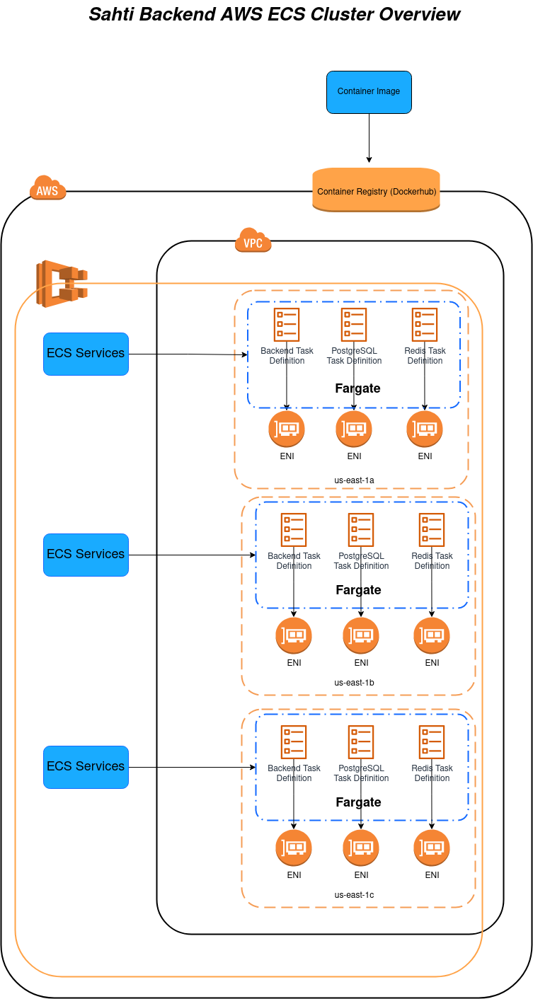
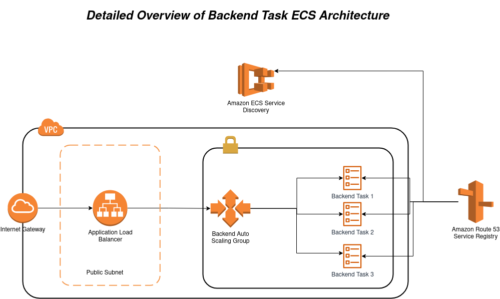

# Sahti IAC
This is the Sahti backend project implemented in AWS ECS using Terraform. 
# Architecture
## Overviews of ECS Cluster Architecture
   
- I have used ECS Fargate in this project.
- Our Tasks were distributed in 3 availability zones as shown in the image above.
- Each task has its own service because these tasks need to communicate between themselves.
- Docker images were pulled from public image registry which is DockerHub.

## Detailed View on Backend Task in ECS Cluster
   
- To make our backend accessible we have exposed it through and Application Load Balancer(ALB)
- ALB will have a listener to forward incoming requests to an Auto Scaling Group (ASG) which will replicate our tasks. In the image above I have made `3` tasks but in `modules/ecs/ecs.tf` the desired count of tasks is only `1` to minimize costs :) .
- These tasks could be reached inside our cluster by other tasks using `ECS Service Discovery.`

# Things to Improve
1- Many hard coded values should be extracted in `variables.tf` file.